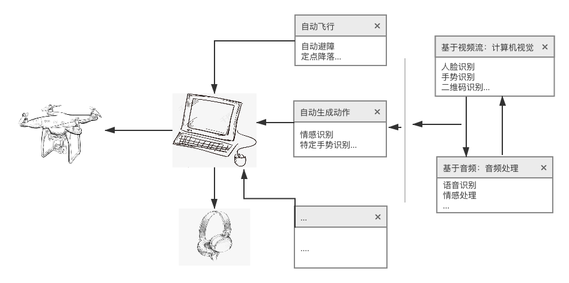
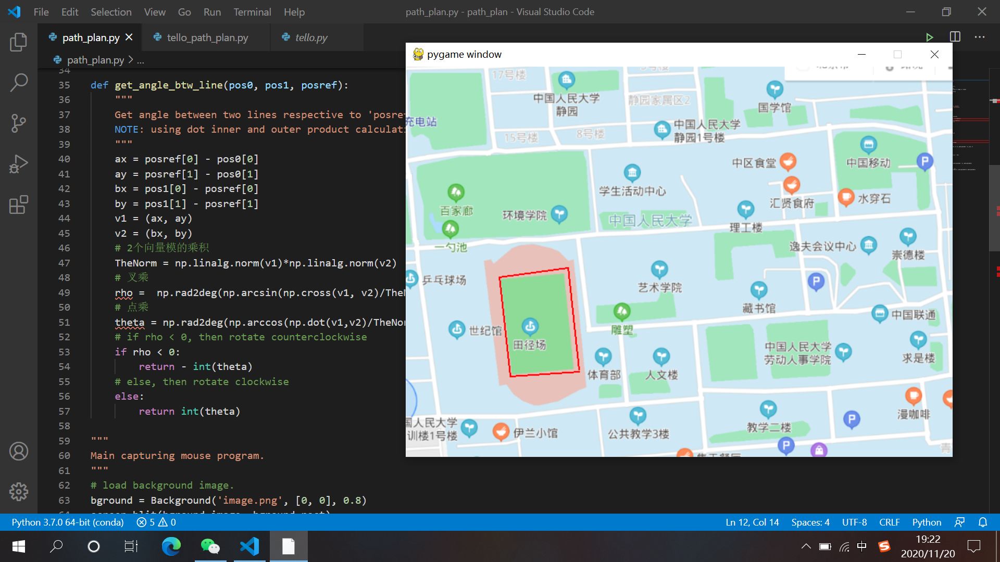
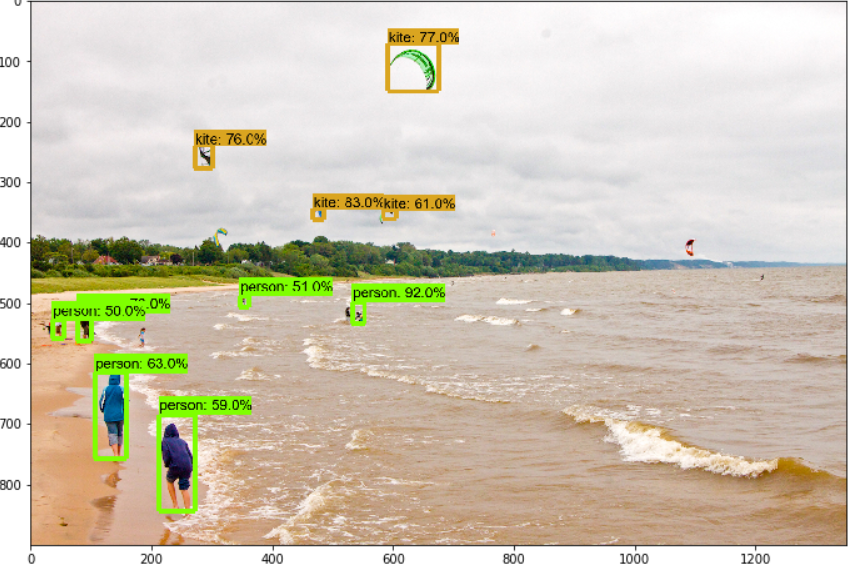
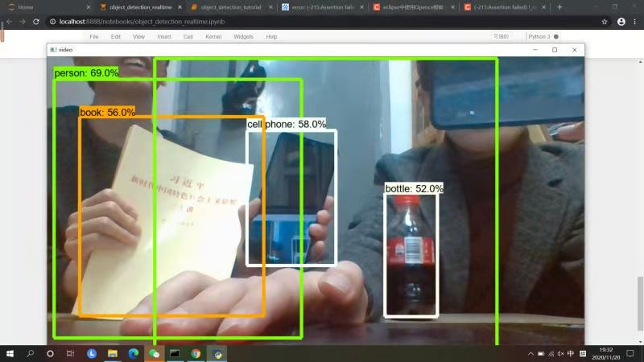
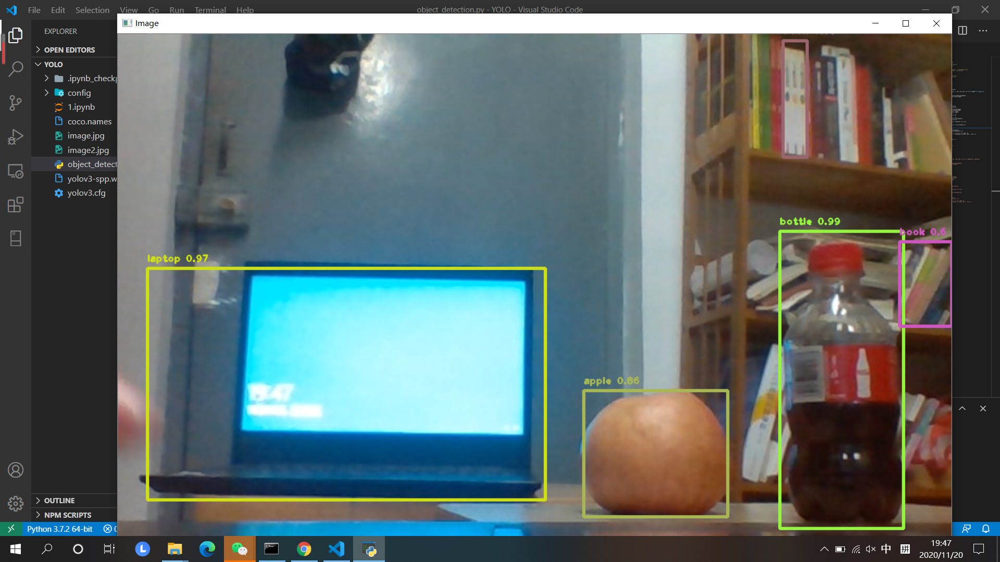

# 无人机实验

赵瑞祥 2018202096

## 项目介绍
我们小组进行有关无人机智能飞行的各项实验，初步打算包括基于音频的语音控制无人机飞行、基于视频的手势控制无人机飞行、人脸追踪的无人机飞行等。

我们每周分别实现一些功能，最后将这些功能组合起来实现一个更加智能的无人机。

## 基于音频的语音控制无人机飞行
我们基于百度api实现了利用语音控制无人机飞行的功能。比如，当用户说“起飞”后，电脑首先识别用户的语音输入，然后调用相应的对无人机飞行的控制函数takeoff()，无人机就实现了起飞功能。

完整函数代码放在: [src/scripts/SpeechRecognitionTello.py](src/scripts/SpeechRecognitionTello.py)

测试语音识别效果如下：

语音控制无人机飞行效果视频见百度网盘：

链接：https://pan.baidu.com/s/1n9AiKVfvzHp84XZP-VlgWQ 

提取码：i7j0 
## 基于人脸识别的人脸追踪的无人机飞行
我们基于多媒体技术课上的图像处理技术实现了人脸自动追踪的无人机飞行控制，无人机会识别摄像头内的人脸，然后自动追踪人脸飞行，包括旋转、上升、下降等。

完整函数代码包括: 

[src/scripts/aarcascade_frontalface_default.xml](src/scripts/haarcascade_frontalface_default.xml)

[src/scripts/main.py](src/scripts/main.py)

[src/scripts/utils.py](src/scripts/utils.py)

人脸识别的效果图如下：

完整人脸追踪的无人机飞行效果视频见百度网盘：

链接：https://pan.baidu.com/s/1n9AiKVfvzHp84XZP-VlgWQ 

提取码：i7j0 

12.18号人脸追踪实验视频更新效果：

链接：https://pan.baidu.com/s/1qj8Ss70VWU29QSgJgSQ32A 
提取码：mjqk 

## 基于手势识别的无人机飞行控制

2020.10.30~2020.11.6

我们j基于百度api初步实现了手势识别技术，测试时我们用自己电脑摄像头（连无人机摄像头同理）实时识别屏幕里出现的手势。目前可以识别1~9九个手势，可以将识别到的手势与无人机的动作联系起来。比如，我们可以指定手势“1”对应takeoff()动作。

手势识别代码放在：[src/scripts/gesture_recongnize/gesture_recongnize.py](src/scripts/gesture_recongnize/gesture_recongnize.py)

测试手势识别过程的一张图片如下（全部图片放在[src/dataset/gesture_pictures](src/dataset/gesture_pictures)下）：

手势识别效果如下：

可以看到1~9九个手势都可以正常识别出来。

## 无人机飞行的路线规划

2020.11.6~2020.11.20

为了让无人机可以按照我们规定的路径进行飞行，我们基于pygame的图形界面实现了一个控制无人机飞行的GUI。以一张中国人民大学的地图图片为例，我们可以在图片上点击要飞行的路径，路线规划函数会把它实际要飞行的路线保存到相应的JSON文件中，根据JSON文件中的数据来控制无人机要飞行的距离、旋转的角度等。

路线规划代码包括：（其中path_plan.py用来根据点击的路线生成JSON文件，tello_path_plan.py用来根据JSON文件控制无人机飞行）

[src/scripts/path_plan/path_plan.py](src/scripts/path_plan/path_plan.py)

[src/scripts/path_plan/tello_path_plan.py](src/scripts/path_plan/tello_path_plan.py)

路线规划的效果如下：

在GUi界面上点击如下路线（绕操场的路径）：

然后会产生刚刚这个路径的信息，路径信息会保存到相应的JSON文件中[src/scripts/path_plan/waypoints.json](src/scripts/path_plan/waypoints.json)：

## 实时物体识别

2020.11.6~2020.11.20

为了将人脸识别、手势识别、自动避障等需要图像识别的功能结和起来，我们决定实现实时物体识别。这两周我们实现了基于YOLO、tenserflow等实现了全物体实时物体识别。但这里实现的物体识别仅仅是对物体种类的划分，比如我们组所有同学都会被识别为person这个类，不会区分具体是哪一个人。因此，后续我们需要利用自己的人脸、手势、测试的避障物等自己拍摄的图片进行模型的训练。

### 基于tensorflow的实时物体识别

框架链接：https://github.com/tensorflow/models/tree/master/research/object_detection
官网描述：

> Creating accurate machine learning models capable of localizing and identifying multiple objects in a single image remains a core challenge in computer vision. The TensorFlow Object Detection API is an open source framework built on top of TensorFlow that makes it easy to construct, train and deploy object detection models. At Google we’ve certainly found this codebase to be useful for our computer vision needs, and we hope that you will as well.

简言之，就是可以在同一张图片中检测并标注目标，而且对用户自己进行训练、应用十分友好。再历经千辛万苦，疯狂配置各种环境之后，我终于在本地成功搭建起来，并且导入了预训练模型，使用官方依据coco数据集训练得到的预权重，成功实现了目标检测。

测试图片：

为了更契合我们的项目，我们使用框架处理摄像头传输的视频，实现了即视的识别：

完整代码参考[src/scripts/object_detection/object_detection_tutorial.ipynb](src/scripts/object_detection/object_detection_tutorial.ipynb)

### 基于YOLO的实时物体识别

模型链接：https://pjreddie.com/darknet/yolo/

yolo模型目前已经发展到了v5版本，我们分别尝试了v3、v4、v5三个版本，大约5、6个预训练模型，使用opencv作为图片处理工具，导入yolo的网络模型和与训练权重,其中v4版本的准确率较高，但是在我的电脑本地上处理速度较慢，大约0.7s处理一帧，目前不符合无人机即时检测的要求。v5版本准确率稍微逊色，但是效率比v4版本提高了十倍，已经符合了无人机的要求。

测试图片：

完整代码参考[src/scripts/object_detection/object_detection.py](src/scripts/object_detection/object_detection.py)

### 缺陷和方向

- 目前所有的框架和模型都是通过CPU进行运算，效率较低，应用到摄像头上之后跳帧更为明显，特别是yolo-v4。下一步的解决方案是利用本地的英伟达1050Ti 的GPU进行运行，主要的难点在与配置显卡的驱动和cudnn加速，其实在这方面这周已经踩了不少的坑，但是最终仍然没有成功应用。下一阶段完成后，预计效率将会大大提升。
- 目前使用的模型为官方预训练模型，可以检测通用的物体 ，如人体、水杯等。我们目前已经开始使用labelimg工具标注自己的数据集进行训练，如我们自己的人脸、无人机的未来跟踪的小球等，以实现个性化的目标识别。
- 由于框架的环境配置过程复杂，不同的硬件设备、系统会有不同的方案和问题，所以本项目可移植性较差，需要先按照各个模型的官方文档配置环境。

## 自训练模型

标注脸部、手势、小球数据，用YOLOv5进行训练，用训练好的模型进行人脸追踪、自动避障。

### 标注数据

标注手势数据（脸部就不放了吧）：

### 训练过程

### 训练结果

## 自动避障

无人机根据识别到的障碍物所在的位置来进行左右避障：

完整代码参考[src/scripts/object_detection/tello_obst_avoid.py](src/scripts/object_detection/tello_obst_avoid.py)

自动避障效果视频：

链接：https://pan.baidu.com/s/1g8jdZBZR4dFx33msmuJ8xA 
提取码：2ogn 